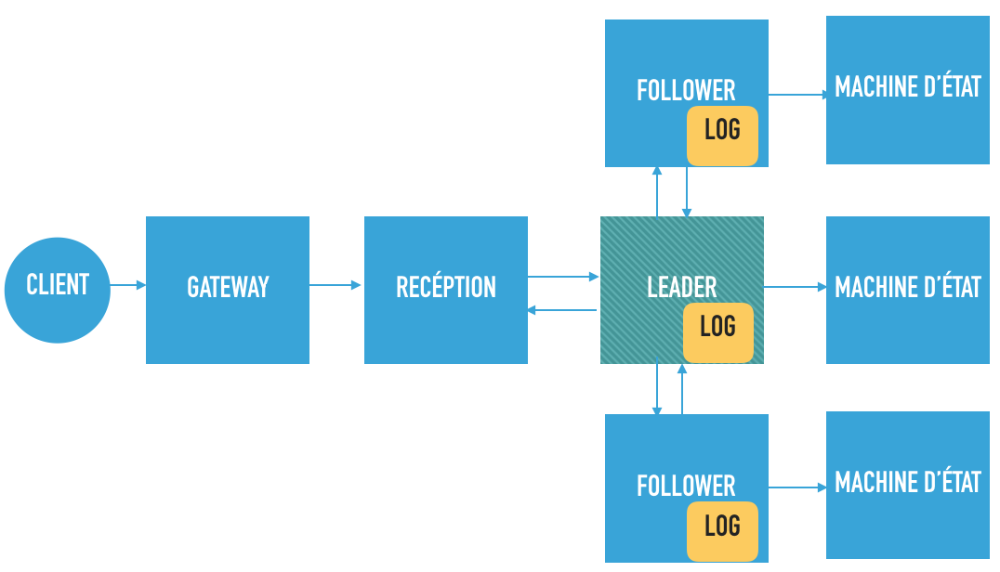
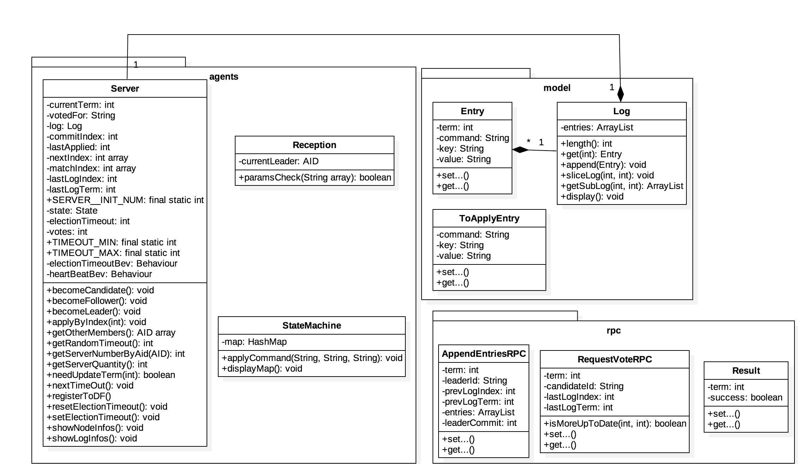
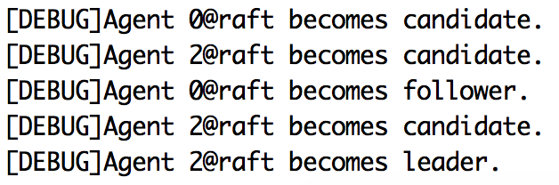
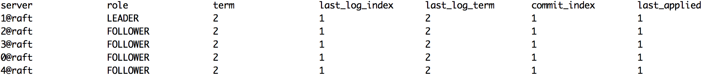
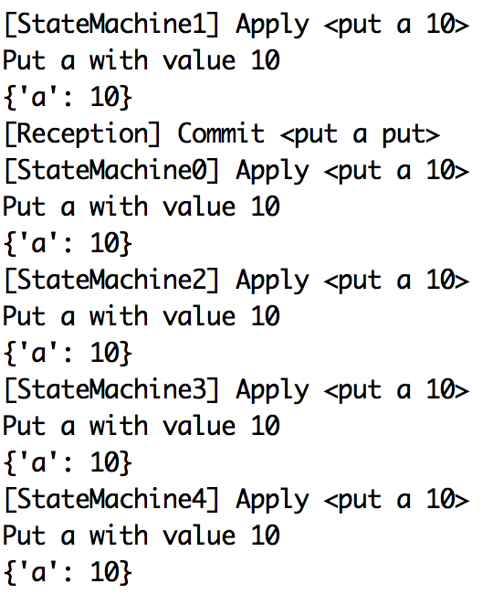
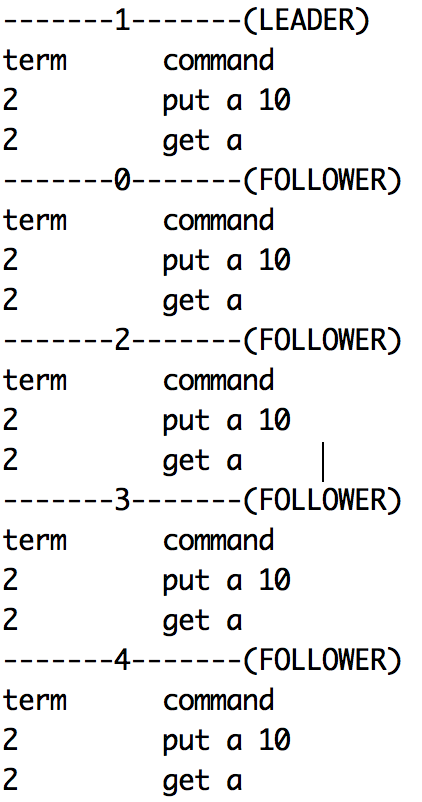

# Implement-raft-on-Jade
##It's a project under the course Multiple-Agent System(IA04). In this project, I implemented the Raft(a consensus algorithme [see Raft homepage](https://raft.github.io)) on a multiple-agent JAVA plateform. The aim is to simulate a distributed key-value based system.
##Agent architecture :

##UML diagram :

Some results are below :
###election process

###shownode

###command "put"

###showlog

